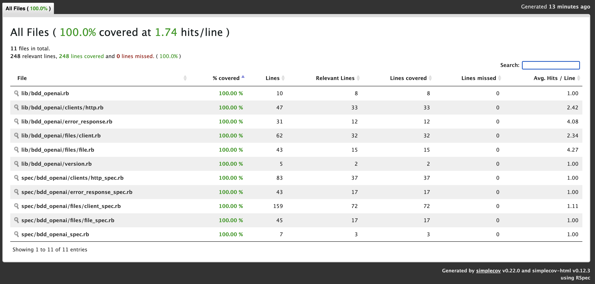

# BddOpenai

This gem is a personal exercise to get familiar with Ruby and Gem creating. gem Gem include only one top level namespace of TestOpenai which you can find all you need inside. Starting by creating an instance of BddOpenai::FileClient.

For this exercise, the client will provide wrapper to some of OpenAI File APIs. API doc can bbe found here:
- https://platform.openai.com/docs/api-reference/files

Other reference links:
- https://github.com/brendondaoateh/bdd_openai
- https://rubygems.org/gems/bdd_openai
- https://rubydoc.info/gems/bdd_openai

## Installation

You can install the gem normally through RubyGems.org.

Install the gem and add to the application's Gemfile by executing:

    $ bundle add bdd_openai

If bundler is not being used to manage dependencies, install the gem by executing:

    $ gem install bdd_openai

## Usage

You can direct interact with gem by:

```ruby
require "bdd_openai"

client = BddOpenai::FileClient.new(ENV["OPENAI_API_KEY"])

client.list_files

client.upload_file("assistants", "spec/fixtures/sample.pdf")

client.delete_file("file-id")

client.retrieve_file("file-id")
```

## Testing

- Copy file `.env.sample` to `.env` and fill in your personal OpenAI API's key
- Run
```
bundle install
rspec
```

### Test coverage

The repository is integrated with [SimpleCov](https://github.com/simplecov-ruby/simplecov) to generate test coverage report. You can find the report at `coverage/index.html` after running the test.



## Contributing

Bug reports and pull requests are welcome on GitHub at https://github.com/brendondaoateh/bdd_openai.
